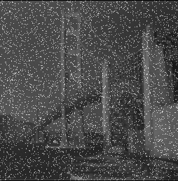
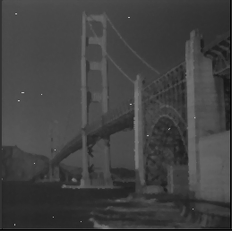
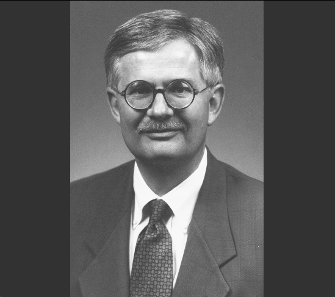
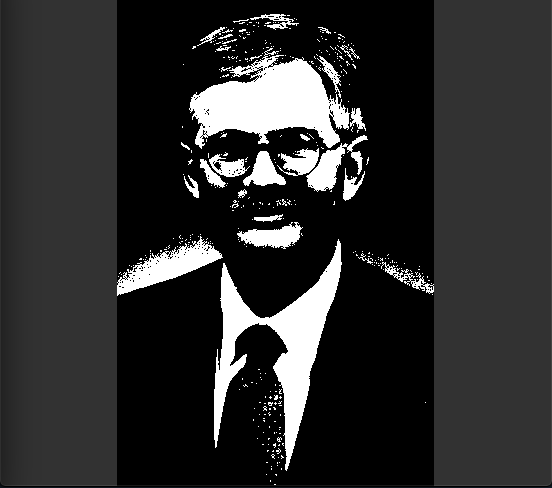

# PgmFilters

## Resumo 📃

Primeira atividade da cadeira de computação gráfica 2018.2 - IFCE. Precisavamos qualquer linguagem para manipular arquivos PGM, e aplicar 4 filtros [**Média**,**Mediana**,**Contraste**, **Limiarização**].

## Ferramentas 🛠

* Python 3.7
  * Pillow
  * Numpy

## Screenshots 📷

|             | Original    | Filtrado     |
| :---        |    :----:   |          ---: |
| Média       |        |  |
| Mediana   |          |      |
| Contraste   |          |      |
| Limiarização   |          |      |

